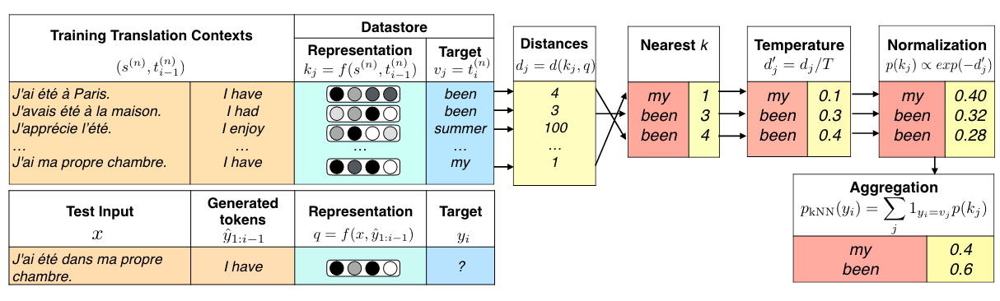
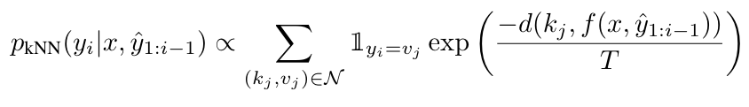
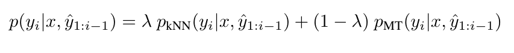
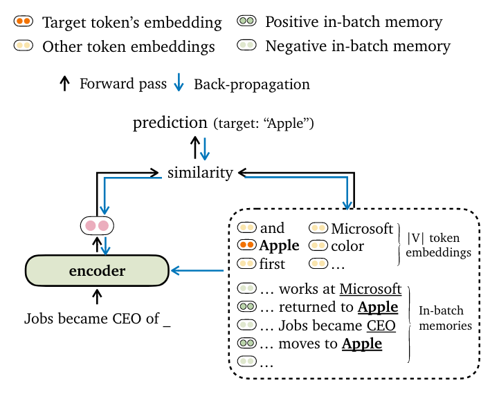
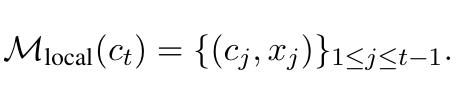
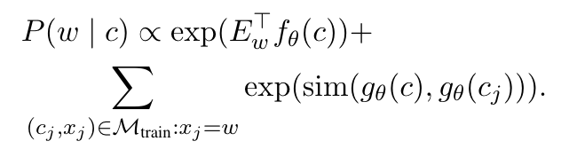
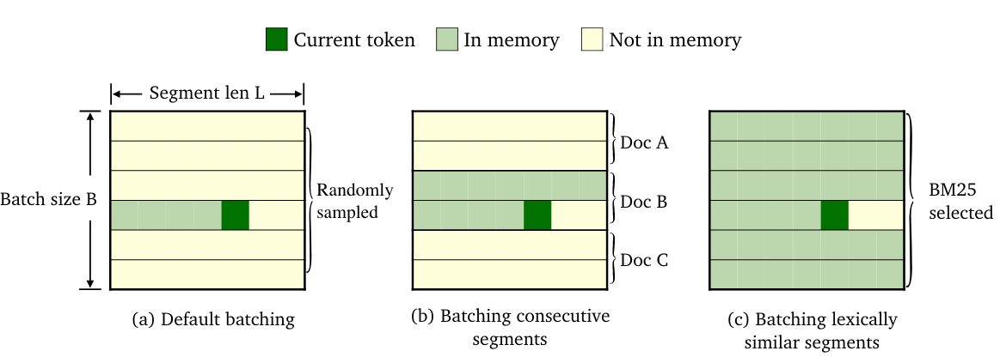

# daily-paper-reading

Short and daily paper reading
 [王青悦论文阅读笔记](#-王青悦论文阅读笔记）
 [张琬悦论文阅读笔记](#-张琬悦论文阅读笔记）
 [傅延赫论文阅读笔记](#-傅延赫论文阅读笔记）

2022-10

<table style="width:100%">
  <tr>
    <th>Name</th>
    <th>Number</th>
    <th>Total</th>
  </tr>
  <tr>
    <td>Qingyue Wang</td>
    <td>3</td>
    <td rowspan=16>4</td>
  </tr>
  <tr>
    <td>Yanhe Fu</td>
    <td>0</td>
  </tr>
  <tr>
    <td>Wanyue Zhang</td>
    <td>1</td>
  </tr>
</table>

(Students are sorted by grade)

### 王青悦论文阅读笔记
  2022-10-25  
*title*:
[NEAREST NEIGHBOR MACHINE TRANSLATION, ICLR 2021](https://arxiv.org/pdf/2010.00710.pdf)

*Authers*: 
Urvashi Khandelwal, Angela Fan, Dan Jurafsky†, Luke Zettlemoyer, Mike Lewis‡

*institute*: 
Stanford University, Facebook AI Research

*Topic*: 
Machine Translation, Non-parametric Method

*Motivation*: 
作者首次将KNN增强的方法用在了机器翻译上，通过在词级别语义的检索和融合，大幅度提高了模型在领域数据集上的效果。

*Details*: 
1.创建数据库。该数据库包含两部分，第一部分是语义表示，该语义是来自由源文本和目标文本的前t-1个单词，第二部分是目标词，也就是目标文本的第t个词。
2.在解码阶段，使用相同的语义编码方式，利用该语义表示，检索获得上述数据库中的最相近的K个结果，使用结果以及相应的距离，结合温度超参数获得第t个单词最终的概率。
这个概率作为目标词概率，以一定的比重添加到原来decoder解码器上。

*Experiments*：
在不增加任何额外训练的情况下，使用新的测试数据发现性能大幅提升，证明了该方法具有很好的领域迁移性。

*Comments*:
上述方式存在两个问题。首先是存储空间，数据库的大小跟词的数量和语义特征的纬度正相关；时间延迟，检索发生在每个解码步，随着数据库的增大，检索时间也会增长。

*title*:
[Training Language Models with Memory Augmentation](https://arxiv.org/pdf/2010.00710.pdf)

*Authers*: 
Zexuan Zhong, Tao Lei, Danqi Chen

*institute*: 
Princeton University

*Topic*: 
Machine Translation, Non-parametric Method

*Motivation*: 
已有无参数的语言模型或者方法都是在测试阶段引入记忆单元（如上文的数据库），或者使用独立的可训练的encoder，
这样的方式并不是最优的。作者将一个batch中的样本当作是记忆单元，并在测试阶段应用了三种记忆单元（局部，长期和外部记忆）。
通过简单修改目标函数，实现了训练和测试在无参数方法中的语义对齐。

*Details*: 
1. 记忆的表示是由(context,target)对构成的, 作者提出了三种记忆：
     * 局部记忆：局部记忆来自同一个输入的其他(context,target)对。作者指出对于transformer模型来说，
      该类记忆其实没有加入的必要，因为self-attention机制本身就可以利用最近的token信息。
     * 
     * 长期记忆：长期记忆是指来自同一个对话文本的长距离context，
   由于transformer的输入长度有限，他们无法直接被attention捕捉到。这里作者将一个文档切分成若干个段落，每一个段落包括L个context。
        
     * 外部记忆：外部记忆假设有外部可用的语料，或者当测试领域存在数据漂移时的特定数据集,可以构造相应的外部记忆。
     * 
2. 带记忆的训练过程：训练过程中使用到的记忆都是从**同一个训练batch**中得到的，这样能够产生反向传播调整记忆的表示。
训练目标可以看作是一种对比损失——对于某个确定的(context, target)对来说，损失函数的目标是对齐context表示与静态的token embedding表示，以及那些共享相同token的context表示。

该目标函数也能很好地处理OOV现象。如果该单词没有出现在训练记忆中，那么目标函数退化成对齐context表示和当前word的embedding。
三种记忆对应构造的data batching如下。

*Experiments*：
作者在三个数据集上进行实验，分别验证了该方法在语言模型和机器翻译任务上的有效性。

*Comments*:
对长距离的语义建模一直存在着模型结构复杂的现象，作者仅仅通过修改目标函数，实现对之前语义的再次利用对齐，是一种可供借鉴的思路。
另外，本文提出的三种记忆很容易迁移到对话中去。

By <i>Qingyue Wang</i>

 2022-10-17 
*title*:
[Learning to Transfer Prompts for Text Generation,NAACL 2022](https://github.com/RUCAIBox/Transfer-Prompts-for-Text-Generation)

*Authers*: 
Junyi Li, Wayne Xin Zhao

*institute*: 
Gaoling School of Artificial Intelligence, Renmin University of China, Beijing Key Laboratory of Big Data Management and Analysis Methods

*Topic*: 
Transfer Learning, Text Generation, Prompt Learning 

*Motivation*: 
真实场景中数据往往是有限的，大量工作关注于利用prompt进行迁移学习。然后，当前在文本生成的迁移学习存在两个问题，其一， prompt是任务高度相关的，很难高校地迁移或者重用到新的任务上；其二，一个学习好的prompt未必适用于所有的样本。本文提出一种新的迁移学习范式。

*Details*: 
作者的应用背景是文本生成，即有T个生成任务作为源任务，学习特定任务的prompt。对于每一个任务，固定transformer，只调节prompt参数，可以获得一个特定任务的prompt。这里的prompt是若干可学习的向量，模型输入是prompt+text，输出是目标文本。

整个过程如下：
1. 将学习到的prompt进行聚类，希望建模源任务之间的相似性。具体地，每一个prompt被看作一个节点，利用spectral聚类算法将源prompt聚成多个类别。
2. 为了将训练好的prompt迁移到目标任务，作者建立了一个多key记忆网络。对于每一个特定的prompt，有两个可学习的key，cluster key来定位cluster，prompt key定位prompt。
3. 之前的工作只考虑了任务信息而没有考虑样本信息。但是，一个特定任务的prompt可能并不适用于所有样本。对于目标任务，作者同时使用任务级别的信息和样本级别的信息来选择合适的prompt，任务级别信息和样本级别信息均由参数固定的BERT得到。
4. 最终通过加权求和的方式确定prompt参数。

*Experiments*：
1.作者将14个数据集分成3类生成任务，分别是压缩（例如摘要任务），转导（文本风格转化）和创新（例如对话）。作者对跨数据集和跨任务都进行了实验，较为充分。
2. 在跨任务的迁移方面，摘要生产和个性对话都达到了不错的效果。在所有基线中，prefix-tuning仅次于本文方法，因此可以多考虑这种prompt学习方式。

*Comments*:
本文考虑了在多任务上prompt新的组合方式，同时考虑到了文本的相似性和prompt的相似性。

**by Qingyue Wang**

### 张琬悦论文阅读笔记
 2022-10-25 
***title*:**
Improving Multi-turn Emotional Support Dialogue Generation with Lookahead Strategy Planning,EMNLP 2022[[paper]](https://arxiv.org/abs/2210.04242) [[code]](https://github.com/lwgkzl/MultiESC)

*Authers*: 
Yi Cheng1∗ , Wenge Liu2∗ , Wenjie Li1† , Jiashuo Wang1,
Ruihui Zhao3, Bang Liu4,Xiaodan Liang5, Yefeng Zheng3

*institute*: 
1-Hong Kong Polytechnic University；2-Baidu Inc., Beijing, China； 3-Tencent Jarvis Lab；4-RALI & Mila, Université de Montréal； 5-Sun Yat-sen University.

*Topic*: Emotional Support Conversation

***Motivation*:** 
提供情感支持（ES）以安抚情绪困扰的人是社交互动中的一项基本能力。现有的关于构建ES会话系统的研究大多只考虑与用户的单回合交互，这过于简化了。相比之下，多回合情感支持对话系统可以更有效地提供情感支持，但面临着一些新的技术挑战，包括：i）如何进行支持策略规划，以获得最佳支持效果；ii）如何动态地建模用户的状态。本文提出了一个名为MultiESC的新系统来解决这些问题。

***Details*:** 
应用背景/面向对象是多轮次的情感支持对话(ESC, Emotional Support Conversation)，作者想在其中构建一种前瞻性启发式并能动态建模的算法。对于策略规划，作者从A*搜索算法中汲取灵感，提出了前瞻性启发式算法，以估计使用特定策略后的未来用户反馈，这有助于选择能够产生最佳长期效果的策略。对于用户状态建模，MultiESC专注于捕捉用户的微妙情绪表达，并了解其情绪原因。具体实验细节见下一部分。

***Experiments*：**

1. 数据集 Experimental dataset: ESConv，每个对话平均29.8个语句，共8个策略（例如，提问、反映情感和自我表露）。

2. NRC VSD词典大小20000英文单词，三个维度（pleased-displeased, excited-calm, dominant-submissive).

3. 策略=策略得分函数中的最大值。策略得分函数=基于历史的参数g(st) +启发式预估未来用户反馈的前瞻得分h(st)×权重超参。个人理解：基于历史=概率，未来预估=数学期望。

   历史：*g(st) = − log Pr(st|Ht, Ut).*    已知Ut是第t轮之前所有用户状态嵌入的级联，st是策略，Ht为对话历史嵌入。Pr猜测是probability , 这个函数可能需要理解A*搜索。

   未来：*h(st) = E[f(st, s>t, Ut)|st, Ht, Ut]*  函数f表示连续应用st和s>t以安慰先前状态为Ut的用户之后的用户反馈得分。

4. 话语解码器的目标是生成下一个对话xt，架构和策略序列生成器一样，只是输入序列不一样（在话语序列前加入一个策略嵌入）

5. 实验结果：MultiESC在所有指标（流畅、共情、识别、建议）上都由于MOEL。它在整体支持效果上也优于BlenderBotJoint，尽管在流畅性方面相对较差，作者认为原因是BlenderBot关节的主干在大规模对话语料库上经过了广泛的预训练。与同样运用了启发式的“w\/o lookahead”相比可以说是不相上下，所以启发式起到了很大作用。

***Comments*:**
本文的novelty是面向多轮对话而非单轮交互，考虑的主要是（在多轮对话中）长期减少用户的情绪困扰，并提出了一种在战略规划和对话生成方面均显著优于baseline的算法MultiESC。但是文章也提到这种算法的**限制limitation**是无法提供个性化对话。**个人思考**：本文算法MultiESC对于对象的情绪分析有很好的效果，那么是否可以通过知识图谱和用户数据库进行个性化对话，然后通过语音指纹或者密码登陆来识别用户（这个涉及隐私和安全问题），但是这种个性化方法对资源要求很高。

**by Wanyue Zhang**

### 傅延赫论文阅读笔记
